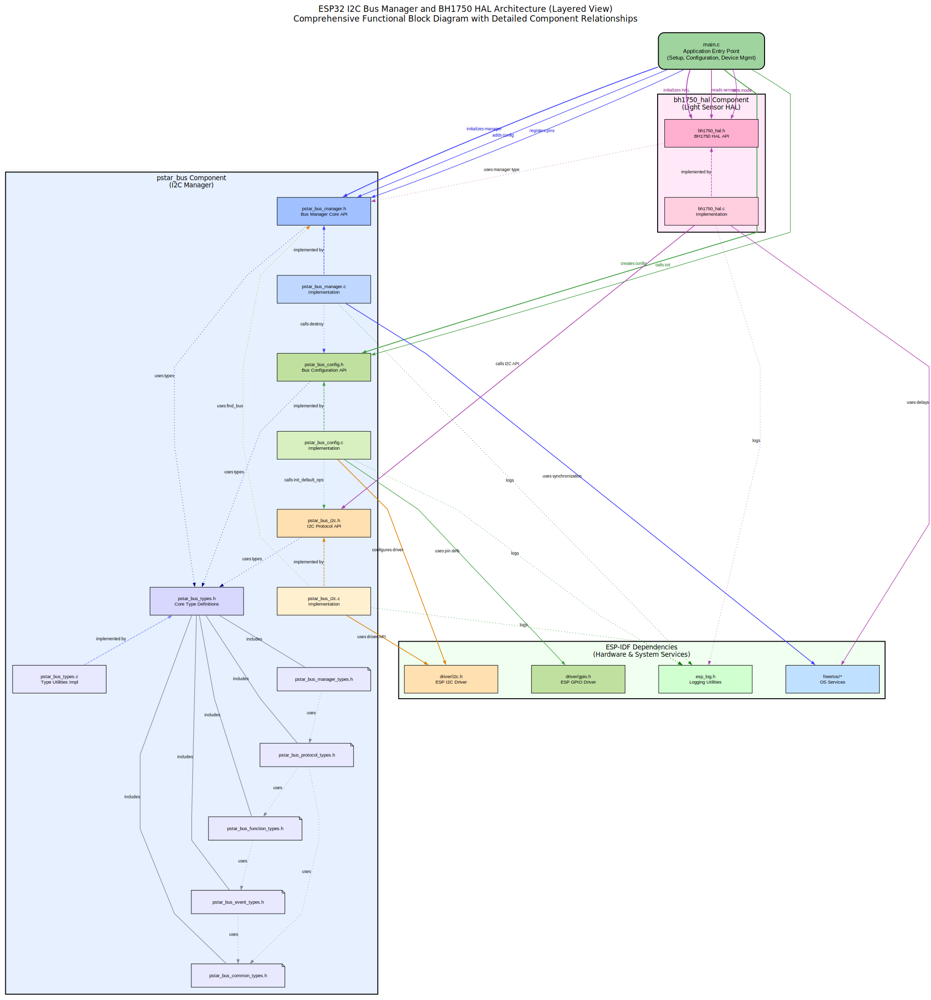

# Project-STAR: Survey and Terrain Analysis Robot (STAR) - **ARCHIVED (ESP32 Version)**

[](https://topographic-robot.github.io/Project-STAR-Documentation/html/index.html) **IMPORTANT NOTICE: Hardware Platform Shift & Archive**

This repository originally contained the ESP32-based firmware for the STAR project. The project is undergoing a significant hardware platform change, migrating from the ESP32 (and potentially FPGA) architecture to the **Texas Instruments SK-TDA4VM platform**.

As such, the content in this repository focusing on ESP32 HALs, ESP-IDF, and related tools is now considered **archived** and **obsolete** for the ongoing development of Project-STAR. Future development efforts will occur in a **separate repository** dedicated to the SK-TDA4VM platform.

This README retains the original ESP32 information for historical reference but **does not reflect the current development target**.

---

**STAR (Survey and Terrain Analysis Robot)** is an advanced terrain-mapping robot designed to autonomously navigate and create detailed 3D mesh topology maps of various landscapes, including hills and valleys. This repository contains the **archived ESP32 firmware** that previously powered early prototypes of STAR.

_(Note: This ESP32 repository is no longer under active development. The project's goal of a fully autonomous mapping robot continues, but on the new SK-TDA4VM platform.)_

## Table of Contents (Archived ESP32 Version)

- [Project-STAR: Survey and Terrain Analysis Robot (STAR) - **ARCHIVED (ESP32 Version)**](#project-star-survey-and-terrain-analysis-robot-star---archived-esp32-version)
  - [Table of Contents (Archived ESP32 Version)](#table-of-contents-archived-esp32-version)
  - [Previously Implemented Features (ESP32)](#previously-implemented-features-esp32)
  - [Previously Supported Hardware Components (ESP32)](#previously-supported-hardware-components-esp32)
  - [Previous Software Stack (ESP32)](#previous-software-stack-esp32)
    - [Architecture Diagram (ESP32 Bus Manager)](#architecture-diagram-esp32-bus-manager)
    - [Dependencies (ESP32)](#dependencies-esp32)
  - [Installation (Archived ESP32 Firmware)](#installation-archived-esp32-firmware)
  - [Configuration (Archived ESP32 Firmware)](#configuration-archived-esp32-firmware)
    - [Using menuconfig (ESP-IDF)](#using-menuconfig-esp-idf)
  - [Running Examples or Main Application (Archived ESP32 Firmware)](#running-examples-or-main-application-archived-esp32-firmware)
  - [JTAG Debugging (Archived ESP32 Firmware)](#jtag-debugging-archived-esp32-firmware)
  - [Contributing (To Archived ESP32 Code - Limited)](#contributing-to-archived-esp32-code---limited)
  - [License](#license)

## Previously Implemented Features (ESP32)

This repository, during its active phase for the ESP32 platform, provided the following firmware features and utilities:

-   **I2C Bus Management:** A manager (`pstar_bus`) to handle I2C bus configurations and operations.
-   **SPI Bus Management:** Integrated into `pstar_bus` to handle SPI bus/device configurations and operations.
-   **Ambient Light Sensing:** HAL (`pstar_bh1750_hal`) for the BH1750 I2C light sensor.
-   **Temperature & Humidity Sensing:** HAL (`pstar_dht22_hal`) for the DHT22 sensor (using a custom 1-wire protocol).
-   **Character LCD Display:** HAL (`pstar_hd44780_hal`) for HD44780-compatible LCDs (4-bit parallel or I2C mode).
-   **Air Quality Sensing (Analog):** HAL (`pstar_mq135_hal`) for the MQ135 analog gas sensor using ESP32's ADC.
-   **PWM/Servo Control:** HAL (`pstar_pca9685_hal`) for the PCA9685 16-channel I2C PWM driver.
-   **IMU Sensing:** HAL (`pstar_mpu6050_hal`) for the MPU6050 6-DOF I2C IMU.
-   **Magnetometer Sensing:** HAL (`pstar_qmc5883_hal`) for the QMC5883 3-axis I2C magnetometer.
-   **TFT LCD Display:** HAL (`pstar_ili9341_hal`) for ILI9341-based SPI TFT displays.
-   **Pin Validation:** Utility (`pstar_pin_validator`) to detect GPIO pin assignment conflicts at compile/runtime setup.
-   **Error Handling:** Utility (`pstar_error_handler`) for basic error tracking and retry logic.
-   **JTAG Configuration:** Utility (`pstar_jtag`) to retrieve JTAG pin configuration from Kconfig.
-   **Modular Design:** Built using ESP-IDF with a modular component structure.
-   **Kconfig Integration:** Most components offered configuration options via `menuconfig`.
-   **Integrated Examples:** Example routines for each HAL component were included.

## Previously Supported Hardware Components (ESP32)

The **archived** ESP32 firmware components supported interaction with the following hardware:

-   **Microcontroller:** ESP32 (various modules)
-   **Sensors:**
    -   BH1750 (Ambient Light - I2C)
    -   DHT22 (Temperature & Humidity - 1-Wire)
    -   MQ135 (Air Quality - Analog/ADC)
    -   MPU6050 (6-DOF IMU - I2C)
    -   QMC5883 (Magnetometer - I2C)
-   **Actuators/Drivers:**
    -   PCA9685 (16-Channel PWM/Servo Driver - I2C)
-   **Displays:**
    -   HD44780-compatible Character LCDs (4-bit parallel or I2C)
    -   ILI9341-based TFT LCDs (SPI)
-   **Debugging:**
    -   JTAG Debugger (e.g., ESP-Prog, FTDI-based)

*(The project now targets the SK-TDA4VM platform, and relevant hardware choices for that platform will be detailed in its dedicated repository.)*

## Previous Software Stack (ESP32)

The archived firmware was developed using the **ESP-IDF** framework (v5.1+ recommended at the time) and written primarily in **C**. It utilized **FreeRTOS** for task management.

### Architecture Diagram (ESP32 Bus Manager)

The `pstar_bus` component provided an I2C and SPI bus manager for the ESP32. The diagram below illustrates its conceptual structure (Historical Reference for ESP32):



_(Note: This diagram is specific to the archived ESP32 implementation.)_

### Dependencies (ESP32)

These dependencies apply only to the **archived ESP32 code**:

-   **ESP-IDF:** v5.1 or later (archived requirement)
-   **FreeRTOS:** Included with ESP-IDF (archived requirement)

## Installation (Archived ESP32 Firmware)

These instructions apply only to the **archived ESP32 firmware** in this repository.

1.  **Clone the Repository:**
    ```bash
    # Recommend cloning to a name indicating it's the archive
    git clone <repository-url> Project-Star-ESP32-Archive
    cd Project-Star-ESP32-Archive
    ```
2.  **Install ESP-IDF:** (Only if you need to build the old code)
    Follow the official ESP-IDF installation instructions appropriate for the version used by this archived code (e.g., v5.1). Ensure environment variables are set.
    [https://docs.espressif.com/projects/esp-idf/en/v5.1/esp32/get-started/index.html](https://docs.espressif.com/projects/esp-idf/en/v5.1/esp32/get-started/index.html)
3.  **Set Target MCU:**
    ```bash
    # Within the ESP-IDF environment
    idf.py set-target esp32
    ```

## Configuration (Archived ESP32 Firmware)

These instructions apply only to the **archived ESP32 firmware** using ESP-IDF's `menuconfig`.

### Using menuconfig (ESP-IDF)

1.  Run `idf.py menuconfig` from the project root (within the ESP-IDF environment).
2.  Navigate: Go to `Project Star Components Configuration`.
3.  Select Example or Main App / Configure Components as needed for the ESP32 code.
4.  Save and Exit.

## Running Examples or Main Application (Archived ESP32 Firmware)

These instructions apply only to the **archived ESP32 firmware**. Ensure you have the correct ESP-IDF environment set up.

1.  **Configure Selection:** Use `idf.py menuconfig` as described above.
2.  **Build:** `idf.py build`
3.  **Flash:** `idf.py flash [-p /dev/your_port_name]` (Replace port if needed)
4.  **Monitor:** `idf.py monitor` (Press `Ctrl+]` to exit)

## JTAG Debugging (Archived ESP32 Firmware)

These instructions apply only to the **archived ESP32 firmware**.

1.  **Hardware Setup:** Connect ESP32 JTAG pins (TCK, TMS, TDI, TDO) to a compatible debugger (e.g., ESP-Prog, FTDI).
2.  **Configure Pins:** Use `idf.py menuconfig` -> `Project Star Components Configuration` -> `JTAG Configuration` to enable and set JTAG pins if needed.
3.  **Build and Flash:** `idf.py build flash`
4.  **Start Debug Session:** Use ESP-IDF tools (`idf.py openocd`, GDB). Refer to the official ESP-IDF JTAG debugging documentation for details corresponding to your ESP-IDF version.

## Contributing (To Archived ESP32 Code - Limited)

Contributions to this **archived ESP32 codebase** are generally not expected. If you find a critical historical bug, please follow standard Git practices (fork, branch, pull request). Adhere to the existing C code style. The pre-commit hooks (`./precommit.sh`, `./apply_clang_format.sh`, `./add_file_header.sh`) may still be relevant for checking/formatting the old code.

*(Contributions to the ongoing Project-STAR development should be directed to the new repository for the SK-TDA4VM platform.)*

## License

This project is licensed under the MIT License - see the `LICENSE` file for details.
